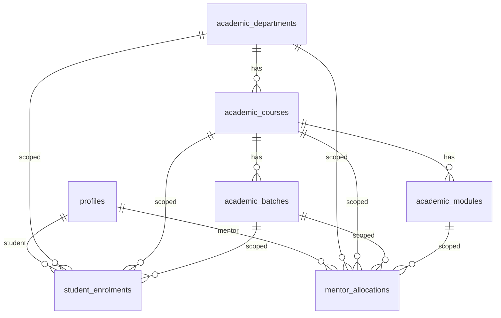

# AJ OS — LMS Module Audit

**Date:** 2026-08-01  
**Scope:** Learning, Assessment & Student Support System for AJ Academy OS  
**Rule:** No broad LMS tables/pages until this audit is complete. This document is that gate.

---

## 1. Executive verdict

AJ OS is a **CRM + operations platform** with a thin education layer (student/mentor portals, tasks, counselling, portfolio). It is **not** an LMS today.

| Area | Status |
|------|--------|
| Auth / roles (`admin`, `mentor`, `student`, …) | Reusable |
| Profile department / course labels | Reusable as seed; not structured entities |
| Mentor → student link (`assigned_mentor_id` + same-department) | Partial — upgrade to effective-dated allocations |
| Ops tasks (`tasks`) | Do **not** overload for graded coursework |
| Notifications (in-app + FCM) | Reusable |
| Audit logs | Reusable |
| File storage patterns | Reusable patterns; need **private** LMS buckets |
| Courses / batches / enrolments | **Missing** |
| Assignments / projects / tests / materials / tickets | **Missing** |

---

## 2. Existing database map (relevant)

### 2.1 Identity & org

| Table | Role | LMS relevance |
|-------|------|---------------|
| `auth.users` | Supabase Auth | Source of truth for login |
| `profiles` | App user row (`role`, `department`, `course`, `assigned_mentor_id`, `status`) | Students & mentors live here |
| `employee_details` | Employee HR extras | Not academic |
| `system_settings` (`hr_org`) | JSON lists: `departments[]`, `courses[]` | Seed source only |

**No** `users` table beyond Auth + `profiles`.

### 2.2 “Students” (two concepts — do not conflate)

| Concept | Table | Notes |
|---------|-------|-------|
| Portal student | `profiles` where `role = 'student'` | Can log into `/student/*` |
| CRM lead | `clients` (Student Master) | Sales pipeline; **no FK** to `profiles` |

Admission status strings on `clients` (`admitted` / `enrolled`) are CRM-only. LMS must use **enrolment rows** on portal students.

### 2.3 Mentor model today

- Role: `profiles.role = 'mentor'`
- Primary link: `profiles.assigned_mentor_id` (student → mentor)
- Fallback: same `department` text match via `mentor_can_see_profile()`
- Mentor can assign **ops tasks** to same-department students (`mentor_department_tasks.sql`)

**Gaps:** no course/batch/module scope, no start/end dates, no primary/secondary, no allocation audit trail, no multi-department authorization record.

### 2.4 Departments / courses / batches

| Concept | Current representation | Structured? |
|---------|------------------------|-------------|
| Department | `profiles.department` text + `hr_org.departments` | No |
| Course | `profiles.course` text + `hr_org.courses` | No |
| Batch / class | CRM `preferred_batch`; UI sometimes labels department as batch | No |
| Enrolment | Implicit: user exists with `role=student` | No |
| Subject / module | None | No |

### 2.5 Closest existing “assignment” system

`tasks` + `task_activities` + `task-attachments` bucket:

- Assignee: single `assigned_to`
- Types: `lead` | `project` | `college` (ops/CRM)
- Progress %, attachments, notifications

**Recommended action:** Keep `tasks` for ops. Build separate LMS `lms_assignments` (name TBD in migrations) with recipients, versions, grades.

### 2.6 Projects today

`projects` / `project_team_members` = **client delivery / Project Master**, not academic student projects.

### 2.7 Notifications

| Channel | Mechanism |
|---------|-----------|
| In-app | `in_app_notifications` + Realtime |
| FCM | `push_devices` + `lib/push/sendPushNotification.ts` |
| Email | Resend (counselling), Zoho/Gmail (CRM outreach) |

### 2.8 Audit

`audit_logs` + `lib/hr/auditLog.ts` (`writeAuditLog`). Reuse for mentor allocation and LMS publish events.

### 2.9 Storage buckets

| Bucket | Public? | Reuse for LMS? |
|--------|---------|----------------|
| `task-attachments` | yes | Pattern only — **not** for graded work |
| `proposals` | private | Pattern for signed URLs |
| `employee-documents` | private | Pattern |
| `payslips` | private | Pattern |
| `attendance-selfies` | yes | No |
| `portfolio-templates` | — | No |

**Missing private buckets:** assignment/project/test/material/proctoring/query attachments.

### 2.10 Roles & portals

| Role | Portal | Gate |
|------|--------|------|
| `super_admin`, `admin` | `/admin/*` | `requireRole` |
| `employee` | `/employee/*` | |
| `mentor` | `/mentor/*` | |
| `student` | `/student/*` | |
| `freelancer` | `/freelancer/*` | |

Middleware is **passthrough**; security is layout + API helpers + RLS.

### 2.11 Existing navigation (anchors for LMS)

**Student:** Dashboard, Attendance, My Tasks, Portfolio, Counselling, Leave, Policies, Profile  

**Mentor:** Dashboard, Attendance, Assign Tasks, My Tasks, Counselling, Reimbursement, Profile  

**Admin:** Dashboard, HR/Payroll, Counselling, CRM, Project Master, Task Assignment, Portfolio, Reports, Settings, …

LMS nav must be **added under existing sidebars**, not a separate app shell.

---

## 3. Feature-by-feature audit

### Feature: Mentor allocation (department / course / batch / module / period)

- **Current status:** Incomplete (single `assigned_mentor_id` + department string match)
- **Existing files:** `aj_academy_platform_expansion.sql`, `mentor_department_tasks.sql`, User Master, counselling
- **Existing database source:** `profiles.assigned_mentor_id`, `profiles.department`
- **Existing functionality:** Mentor sees same-dept students; counselling filter
- **Missing functionality:** Effective dates, primary/secondary, course/batch/module scope, multi-allocation, audit, inactive without deleting history
- **Migration required:** Yes — `mentor_allocations` + academic dimension tables + RLS
- **Security risk:** Mentors can see entire department by string match (over-broad)
- **Recommended action:** Phase 1 — new allocation engine; keep `assigned_mentor_id` as optional cache of primary mentor

### Feature: Academic departments / courses / batches / modules

- **Current status:** UI-only lists in Settings (`hr_org`)
- **Existing files:** `lib/hrOrg.ts`, Settings HR Org panel
- **Existing database source:** `system_settings` JSON
- **Existing functionality:** Dropdown labels on User Master
- **Missing functionality:** Normalized tables, FKs, enrolment, academic year
- **Migration required:** Yes
- **Security risk:** Typo drift between profile strings and settings lists
- **Recommended action:** Create `academic_*` tables; sync/seed from `hr_org` + profile strings

### Feature: Student enrolment

- **Current status:** Missing (implicit profile role)
- **Existing files:** User Master create student
- **Existing database source:** `profiles.role = 'student'`
- **Existing functionality:** Login + student portal
- **Missing functionality:** Course/batch enrolment history, status, transfer without rewriting history
- **Migration required:** Yes — `student_enrolments`
- **Security risk:** Mentors infer students from department text only
- **Recommended action:** Derive LMS audiences from enrolments, not CRM `clients`

### Feature: Assignments (graded coursework)

- **Current status:** Missing (ops `tasks` are not coursework)
- **Existing files:** `TaskAssignmentPage`, `lib/taskAttachments.ts`
- **Existing database source:** `tasks`
- **Existing functionality:** Assign task, attach files, complete with %
- **Missing functionality:** Recipients, due/late rules, attempts, rubric, versioned submissions, grades
- **Migration required:** Yes — new LMS assignment schema (do not alter `tasks` semantics)
- **Security risk:** Using public `task-attachments` for submissions
- **Recommended action:** Phase 3 after audience engine

### Feature: Academic projects (milestones / teams)

- **Current status:** Missing (Project Master is client work)
- **Existing files:** `ProjectMasterWorkbench`
- **Existing database source:** `projects`
- **Existing functionality:** Client project tracking
- **Missing functionality:** Academic milestones, viva, team contribution
- **Migration required:** Yes — separate `lms_projects*` tables
- **Security risk:** Confusing names with ops projects
- **Recommended action:** Prefix LMS tables; never reuse `projects`

### Feature: Secure tests / question bank / proctoring

- **Current status:** Missing
- **Existing files:** None
- **Existing database source:** None
- **Existing functionality:** None
- **Missing functionality:** Full Phase 5–13
- **Migration required:** Yes (later phases)
- **Security risk:** Client-only timers, public media, weak tab-switch handling
- **Recommended action:** Build after assignments; private `test-proctoring` bucket + consent

### Feature: Study materials

- **Current status:** Missing
- **Existing files:** Portfolio templates (unrelated)
- **Existing database source:** None for materials
- **Existing functionality:** None
- **Missing functionality:** Upload, assign, view/download tracking
- **Migration required:** Yes
- **Security risk:** Public buckets
- **Recommended action:** Private `study-materials` bucket + recipient rows

### Feature: Queries & complaints

- **Current status:** Missing (salary queries only)
- **Existing files:** HR salary queries
- **Existing database source:** `salary_queries`
- **Existing functionality:** Payroll questions
- **Missing functionality:** Academic tickets, sensitive complaint routing, threads
- **Migration required:** Yes — `student_tickets*`
- **Security risk:** Routing sensitive complaints to accused mentors
- **Recommended action:** Strict RLS + admin/HR-only sensitive categories

### Feature: Audience assignment engine

- **Current status:** Missing
- **Existing files:** Task single-assignee picker; CRM bulk pick for ops tasks
- **Existing database source:** N/A
- **Existing functionality:** Pick one assignee or pin CRM leads to tasks
- **Missing functionality:** Snapshot recipients at publish time
- **Migration required:** Yes — shared recipient pattern
- **Security risk:** Dynamic-only audience changes history
- **Recommended action:** Phase 2 canonical `*_recipients` tables

### Feature: Notifications for learning events

- **Current status:** Reusable infrastructure; LMS event types missing
- **Existing files:** `lib/push/sendPushNotification.ts`, in-app bell
- **Existing database source:** `in_app_notifications`, `push_devices`
- **Existing functionality:** Task / counselling / HR pushes
- **Missing functionality:** LMS types, scheduled due reminders (idempotent)
- **Migration required:** Soft — new `type` values + optional academic notification log
- **Security risk:** Notifying wrong recipients if audience wrong
- **Recommended action:** Extend existing sender; never invent a second push stack

### Feature: Reports (academic)

- **Current status:** Ops analytics only
- **Existing files:** `AnalyticsWorkbench`, payroll reports
- **Existing database source:** CRM/attendance/finance
- **Existing functionality:** Lead/attendance/finance KPIs
- **Missing functionality:** Assignment completion, test proctoring, material engagement
- **Migration required:** Views/RPCs after LMS tables exist
- **Security risk:** Export leaking cross-department data
- **Recommended action:** Phase 20; filter by allocation scope

### Feature: Calendar (academic)

- **Current status:** Partial — Reminders & Calendar (`aj_reminders*`)
- **Existing files:** `/admin/reminders`, `/employee/reminders`
- **Existing database source:** `aj_reminders*`
- **Existing functionality:** General reminders
- **Missing functionality:** Unified academic event feed
- **Migration required:** Optional view over LMS dates + reminders
- **Security risk:** Showing unauthorized events
- **Recommended action:** Phase 19 — compose from recipient-scoped dates

### Feature: File storage for LMS

- **Current status:** Patterns exist; LMS buckets missing
- **Existing files:** `lib/proposalFiles.ts`, `lib/taskAttachments.ts`
- **Existing database source:** `storage.buckets` / policies
- **Existing functionality:** Signed URLs for private proposals/payslips
- **Missing functionality:** LMS buckets + path scheme + virus-scan hook
- **Migration required:** Yes — storage SQL + policies
- **Security risk:** Public URLs, cross-student path guessing
- **Recommended action:** Private buckets; signed URLs only; audit downloads

### Feature: Student / Mentor / Admin dashboards (learning overview)

- **Current status:** Dashboards exist for ops, not LMS KPIs
- **Existing files:** `app/*/dashboard/page.tsx`
- **Existing database source:** Mixed ops tables
- **Existing functionality:** Attendance, tasks, CRM
- **Missing functionality:** Due assignments, upcoming tests, open tickets
- **Migration required:** No (UI queries new tables)
- **Security risk:** Blanking on refetch (recently fixed for CRM)
- **Recommended action:** Add cards with stale-while-revalidate patterns

---

## 4. Existing features to reuse

1. `profiles` + `requireRole` + portal layouts / `DashboardLayout` / `Sidebar`
2. `is_admin()`, `is_mentor_role()`, `get_user_role()`
3. `audit_logs` + `writeAuditLog`
4. `sendPushNotification` + in-app notifications + Realtime bell
5. Private storage + signed URL pattern (`proposals`, payslips)
6. `hr_org` department/course lists as **seed**
7. `PageHeader`, workbench UI patterns, pagination, `CrmFlash`-style feedback
8. Policy acceptance gate (model for proctoring consent later)
9. Counselling as complementary mentor–student channel (keep separate)

## 5. Incomplete / UI-only / missing

| Category | Items |
|----------|-------|
| Incomplete | Mentor scope, student–course link, CRM→portal handoff |
| UI-only | Department/course as Settings strings without FKs |
| Missing | Enrolments, batches, LMS assignments/projects/tests/materials/tickets, private LMS storage, academic reports |

## 6. Missing relationships (must add)

```
academic_departments 1—* academic_courses 1—* academic_batches
academic_courses 1—* academic_modules
profiles(student) 1—* student_enrolments *—1 batch/course/department
profiles(mentor) 1—* mentor_allocations *—1 dept/course/batch/module
learning_item 1—* learning_item_recipients *—1 student
```

## 7. Permissions & RLS gaps

| Gap | Risk |
|-----|------|
| Department string match for mentors | Over-exposure |
| No enrolment-scoped RLS | Wrong students in pickers |
| Public task-attachments | Leak if reused for submissions |
| No sensitive-complaint isolation | Privacy / compliance |

## 8. Required migrations (ordered)

| # | Script (proposed) | Purpose |
|---|-------------------|---------|
| 1 | `lms_01_academic_foundation.sql` | Departments, courses, batches, modules, enrolments, seed helpers |
| 2 | `lms_02_mentor_allocations.sql` | Allocations + RLS + audit hooks |
| 3 | `lms_03_audience_engine.sql` | Shared recipient types / helpers |
| 4 | `lms_04_assignments.sql` | Assignments + submissions + evaluations |
| 5 | `lms_05_projects.sql` | Academic projects + milestones |
| 6 | `lms_06_study_materials.sql` | Materials + activity |
| 7 | `lms_07_tickets.sql` | Queries & complaints |
| 8 | `lms_08_tests_core.sql` | Tests, questions, attempts, answers |
| 9 | `lms_09_tests_proctoring.sql` | Violations, media, consent |
| 10 | `lms_10_storage_buckets.sql` | Private buckets + policies |

## 9. Technical risks

1. Confusing CRM `clients` with portal students  
2. Overloading ops `tasks` / `projects`  
3. Client-trusted test timers  
4. False-positive tab-switch auto-submit  
5. Camera storage without consent / retention  
6. Partial publish without transactions  
7. Dynamic audiences rewriting history  
8. Mentors retaining access after allocation expiry if RLS wrong  

## 10. Recommended implementation order

1. **Audit** (this document)  
2. **Academic foundation + mentor allocation** (Phase 1)  
3. **Audience engine** (Phase 2)  
4. **Assignments** (Phase 3)  
5. **Projects** (Phase 4)  
6. **Study materials** (Phase 14 early — lower risk than tests)  
7. **Queries & complaints** (Phase 16)  
8. **Basic tests** (Phase 5–6, 11–13)  
9. **Strict mode + camera** (Phase 7–10)  
10. **Calendar + reports** (Phase 18–20)  
11. **Hardening, RLS tests, docs, deploy**

---

## 11. Database diagram (target — Phase 1 first)



---

## 12. Phase gate

| Gate | Status |
|------|--------|
| Existing schema audited | Done |
| Reuse vs rebuild decisions recorded | Done |
| Migrations proposed | Done |
| Phase 1 mentor allocation implemented | **Done** (SQL + Admin/Mentor/Student UI) |
| Phase 2–3 audience + assignments | **Done** (`lms_03` + mentor/student assignment UI) |
| Phase 4 academic projects | **Done** (`lms_04` + UI) |
| Phase 14 study materials | **Done** (`lms_05` + UI; link-first, private bucket ready) |
| Phase 16 queries & complaints | **Done** (`lms_06` + UI; sensitive admin-only) |
| Phase 5+ secure tests | Pending |
| Ready for assignments UI / publish flow | After running L1–L6 SQL in Supabase |

**Do not** implement secure tests or camera until Phases 1–4 + materials/tickets foundations are stable and RLS-tested.
