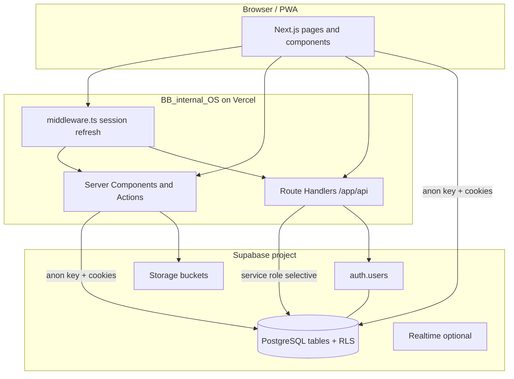
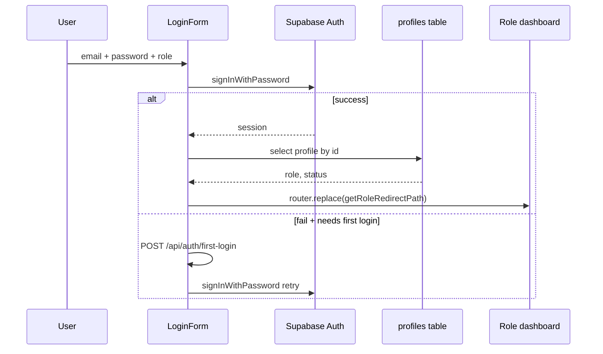
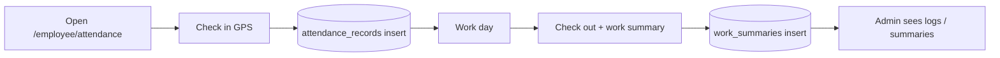
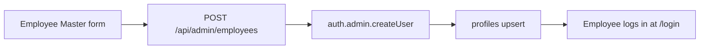

# BB Internal OS — Project Overview

Complete reference for **BB Internal OS**: a role-based internal operations platform for Birthmark Brahma (attendance, CRM, projects, tasks, finance, policies, and HR).

**Production app:** [https://bb-internal-os.vercel.app](https://bb-internal-os.vercel.app)  
**Repository layout:** two top-level folders — app code vs database SQL.

---

## Table of contents

1. [Repository structure](#1-repository-structure)
2. [Technology stack](#2-technology-stack)
3. [High-level architecture](#3-high-level-architecture)
4. [Environments and deployment](#4-environments-and-deployment)
5. [Environment variables](#5-environment-variables)
6. [Authentication and session flow](#6-authentication-and-session-flow)
7. [Authorization (roles and RLS)](#7-authorization-roles-and-rls)
8. [Application routes by role](#8-application-routes-by-role)
9. [API routes](#9-api-routes)
10. [Feature modules (UI ↔ database)](#10-feature-modules-ui--database)
11. [Supabase database model](#11-supabase-database-model)
12. [SQL setup order (Supabase)](#12-sql-setup-order-supabase)
13. [Key libraries and shared components](#13-key-libraries-and-shared-components)
14. [End-to-end data flows](#14-end-to-end-data-flows)
15. [PWA (installable app)](#15-pwa-installable-app)
16. [Operational checklist](#16-operational-checklist)
17. [Major changes log](#17-major-changes-log)

---

## 1. Repository structure

```
BB-internal-OS/                    ← Git root
├── BB_internal_OS/                 ← Next.js 16 application (frontend + API routes)
│   ├── app/                        ← App Router pages, layouts, API
│   ├── components/                 ← Feature UI (attendance, finance, CRM, …)
│   ├── lib/                        ← Supabase clients, auth, helpers
│   ├── hooks/                      ← React hooks (e.g. HR org settings)
│   ├── types/                      ← TypeScript types (profile, leads, …)
│   ├── public/                     ← Static assets, service worker, icons
│   ├── middleware.ts               ← Session gate for protected URL prefixes
│   └── package.json
│
└── BB_internal_SB/                 ← Supabase SQL (schema, RLS, migrations)
    ├── schema.sql                  ← Core: profiles, employee_details, helpers
    ├── DATABASE_SETUP_ORDER.txt    ← Authoritative script run order
    ├── attendance_module.sql       ← Recommended all-in-one attendance bundle
    └── … (feature-specific .sql files)
```

| Folder | Purpose |
|--------|---------|
| `BB_internal_OS` | Everything users interact with in the browser |
| `BB_internal_SB` | Database definitions run manually in Supabase SQL Editor |

There is **no separate backend server** — business logic lives in Next.js Server Components, Server Actions, and Route Handlers, talking to Supabase.

---

## 2. Technology stack

| Layer | Choice |
|-------|--------|
| Framework | **Next.js 16.2.4** (App Router, Turbopack build) |
| UI | **React 19**, **TypeScript 5** |
| Styling | **Tailwind CSS 4**, shadcn-style components, Lucide icons |
| Charts | Recharts |
| Database & auth | **Supabase** (PostgreSQL + Auth + Storage + Realtime) |
| Hosting | **Vercel** (documented production URL) |
| PWA | Web manifest + service worker (`public/sw.js`) |

---

## 3. High-level architecture



### Connection types

| Client | File | When used |
|--------|------|-----------|
| Browser | `lib/supabase/client.ts` | Client components (attendance check-in, CRM, live updates) |
| Server | `lib/supabase/server.ts` | Server Components, layouts, server actions (respects RLS via user session) |
| Admin / service | `lib/supabase/admin.ts` | **Server-only** — bypasses RLS: employee creation, first-login, some admin attendance loads |

**Identity link:** `profiles.id` = `auth.users.id` (UUID). Most business data references `profiles.id` as `employee_id` or `assigned_to`.

---

## 4. Environments and deployment

| Environment | Typical use |
|-------------|-------------|
| Local | `npm run dev` in `BB_internal_OS`, `.env.local` with Supabase keys |
| Production | Vercel deploy from `main`; env vars in Vercel project settings |

**Supabase** must be the **same project** as `NEXT_PUBLIC_SUPABASE_URL` (run all SQL from `BB_internal_SB` there).

**Auth redirect URLs** (Supabase Dashboard → Authentication → URL configuration) should include:

- `https://bb-internal-os.vercel.app/auth/callback`
- `https://bb-internal-os.vercel.app/reset-password`
- Local dev: `http://localhost:3000/auth/callback`, `http://localhost:3000/reset-password`

---

## 5. Environment variables

Create `BB_internal_OS/.env.local` (never commit secrets):

| Variable | Required | Purpose |
|----------|----------|---------|
| `NEXT_PUBLIC_SUPABASE_URL` | Yes | Supabase project URL |
| `NEXT_PUBLIC_SUPABASE_ANON_KEY` | Yes | Public anon key (RLS-enforced) |
| `SUPABASE_SERVICE_ROLE_KEY` | Yes | Server-only admin operations |
| `NEXT_PUBLIC_SITE_URL` | Recommended | PWA manifest absolute URLs (e.g. `https://bb-internal-os.vercel.app`) |
| `VERCEL_URL` | Auto on Vercel | Fallback for PWA origin on previews |

---

## 6. Authentication and session flow

### Login (`/login`)

1. User selects role (Admin / Employee / Manager / Accounts), email, password.
2. `LoginForm` calls `supabase.auth.signInWithPassword`.
3. If sign-in fails and account **never signed in before** → optional **first-login** API sets password via service role.
4. After auth success → load `profiles` row → verify role matches selection and `status = active`.
5. Redirect via `getRoleRedirectPath(role)` (see [§7](#7-authorization-roles-and-rls)).

### Forgot / reset password

1. `/forgot-password` → `resetPasswordForEmail` with redirect to `/auth/callback?next=/reset-password`.
2. Email link → `/auth/callback` exchanges `code` for session → `/reset-password`.
3. User sets new password → `updateUser({ password })` → sign out → `/login?reset=ok&email=…`.

### Middleware (`middleware.ts`)

- Refreshes Supabase session from cookies on matched routes.
- If **no session** and path starts with `/admin`, `/employee`, `/manager`, or `/accounts` → redirect to `/login`.
- Does **not** check role (layouts do that).

### Session diagram



---

## 7. Authorization (roles and RLS)

### Roles (`profiles.role`)

| Role | Home dashboard |
|------|----------------|
| `super_admin` | `/admin/dashboard` |
| `admin` | `/admin/dashboard` |
| `employee` | `/employee/dashboard` |
| `manager` | `/manager/dashboard` |
| `accounts` | `/accounts/dashboard` |

Defined in: `lib/auth/roleRedirect.ts`, enforced in `lib/auth/requireRole.ts` per layout.

### Layout guards

Each role section has `app/{role}/layout.tsx` calling `requireRole([...])`:

- Wrong role → redirect to that user’s home (not login).
- Missing profile / inactive → sign out + error on login.

### Row Level Security (RLS)

PostgreSQL **RLS policies** in `BB_internal_SB` restrict which rows each logged-in user can read/write. The app’s anon key always operates as the current user.

Helper functions (in SQL):

- `get_user_role()` — current user’s role from `profiles`
- `is_admin()` — admin or super_admin

**Service role** (API routes only) bypasses RLS for trusted server operations.

---

## 8. Application routes by role

### Public

| URL | File | Purpose |
|-----|------|---------|
| `/` | `app/page.tsx` | Redirect to login |
| `/login` | `app/login/page.tsx` | Sign in |
| `/forgot-password` | `app/forgot-password/page.tsx` | Request reset email |
| `/reset-password` | `app/reset-password/page.tsx` | Set new password from email link |
| `/install` | `app/install/page.tsx` | PWA install help |
| `/auth/callback` | `app/auth/callback/route.ts` | OAuth / recovery code exchange |

### Admin (`super_admin`, `admin`)

| URL | Feature |
|-----|---------|
| `/admin/dashboard` | KPIs, charts, summaries |
| `/admin/attendance` | Tabs: overview, check-in/out logs, permissions, work summaries, monthly report |
| `/admin/employee-master` | Create/edit employees, profiles |
| `/admin/client-lead-master` | CRM workbench (leads & clients) |
| `/admin/project-master` | Projects, team, workload |
| `/admin/task-assignment` | Assign tasks to employees |
| `/admin/finance` | Transactions, claims, project payments |
| `/admin/policies` | Company policy URLs |
| `/admin/reports` | Cross-module reports |
| `/admin/settings` | Company / HR / system JSON settings |

Server actions: `app/admin/attendance/actions.ts` (delete attendance, permission actions, etc.).

### Employee

| URL | Feature |
|-----|---------|
| `/employee/dashboard` | Employee home |
| `/employee/attendance` | Check-in/out, GPS, work summary, history |
| `/employee/my-tasks` | Assigned tasks |
| `/employee/lead-management` | Assigned leads, call/WhatsApp, CSV import/export |
| `/employee/permission` | Permission requests |
| `/employee/leave` | Leave requests |
| `/employee/policies` | View / accept policies |
| `/employee/profile` | Self-service profile & documents |

Wrapped in `PolicyAcceptanceGate` + `EmployeeExperienceLayer` (mood survey, task popup) in `app/employee/layout.tsx`.

Redirects to dashboard (not used): `/employee/finance`, `/employee/client-lead-master`, `/employee/project-master`.

### Manager

| URL | Feature |
|-----|---------|
| `/manager/dashboard` | Manager home |
| `/manager/project-master` | Projects |
| `/manager/task-assignment` | Tasks |
| `/manager/finance` | Finance workbench |

### Accounts

| URL | Feature |
|-----|---------|
| `/accounts/dashboard` | Accounts home |
| `/accounts/project-master` | Projects |
| `/accounts/finance` | Finance |

---

## 9. API routes

| Endpoint | Method | Auth | Purpose |
|----------|--------|------|---------|
| `/api/auth/first-login` | POST | Public | One-time password bootstrap if user never signed in |
| `/api/first-login` | POST | Public | Alias of above |
| `/api/auth/needs-first-login` | POST | Public | Check if email needs first-login flow |
| `/api/admin/employees` | POST | Admin session | Create auth user + profile |
| `/api/admin/employees/[id]` | PATCH | Admin session | Update employee |
| `/api/admin/policies` | GET/POST | Admin | Company policies CRUD |
| `/api/admin/policies/[id]` | PATCH/DELETE | Admin | Policy by id |
| `/api/employee/policies/status` | GET | Employee | Pending policy acceptances |
| `/api/employee/policies/accept` | POST | Employee | Record acceptance |

PWA: `app/manifest.ts` → `/manifest.webmanifest`.

---

## 10. Feature modules (UI ↔ database)

### Attendance

| Area | UI | Database |
|------|-----|----------|
| Employee check-in/out | `app/employee/attendance/page.tsx` | `attendance_records` |
| Work summary at checkout | Same | `work_summaries` (FK to attendance; delete attendance deletes summaries first in app + SQL cascade) |
| Admin logs & reports | `app/admin/attendance/page.tsx`, `components/attendance/*` | `attendance_records`, `work_summaries`, `permission_requests` |
| Daily mood | `EmployeeExperienceLayer` | `employee_daily_mood_checkins` |
| Permission (employee) | `app/employee/permission` | `permission_requests` |

**Time zone:** IST helpers in `lib/datetime.ts`.

### CRM / leads / clients

Single table model: **`clients`** (lead and client rows).

| Area | UI | Database |
|------|-----|----------|
| Admin CRM | `components/client-lead/CrmWorkbench.tsx` | `clients`, `lead_followups`, `lead_activities` |
| Employee leads | `components/employee/leads/EmployeeLeadManagement.tsx` | `clients` (assigned_to), `lead_custom_columns`, `lead_activities` |
| CSV import/export | Employee lead management | Import columns: `lead_name`, `company_name`, `phone`, … |

### Projects & tasks

| Area | UI | Database |
|------|-----|----------|
| Project master | `components/project-master/ProjectMasterWorkbench.tsx` | `projects`, `project_team_members`, `project_activities` |
| Task assignment | `components/task/TaskAssignmentPage.tsx` | `tasks` |
| My tasks | `app/employee/my-tasks` | `tasks` (assignee) |
| Notifications | `InAppNotificationsBell`, task popup | `in_app_notifications`, RPCs on task assign/complete |

### Finance

| Area | UI | Database |
|------|-----|----------|
| Finance workbench | `components/finance/FinanceWorkbench.tsx` | `finance_transactions`, `expense_claims`, `project_payments`, `finance_categories`, `finance_activities` |

### HR & policies

| Area | UI | Database |
|------|-----|----------|
| Employee master | `app/admin/employee-master` | `profiles`; optional `employee_details` |
| Employee profile | `components/employee/profile/EmployeeProfileWorkbench.tsx` | `employee_profile_details`, `employee_documents`, storage `employee-documents` |
| Policies | Admin + `PolicyAcceptanceGate` | `company_policies`, `policy_acceptances` |
| Settings | `components/settings/SettingsWorkbench.tsx` | `system_settings` (JSON key/value) |

### Reports

`components/reports/ReportsWorkbench.tsx` — aggregates across profiles, clients, projects, tasks, attendance, finance.

---

## 11. Supabase database model

### Core identity

| Table | Purpose |
|-------|---------|
| `profiles` | User identity: name, email, role, department, designation, status |
| `employee_details` | HR extras linked by `profile_id` (phone, manager, joined_at) |
| `employee_profile_details` | Extended self-service profile fields |
| `employee_documents` | Document metadata; files in Storage |
| `system_settings` | Company name, HR org, attendance defaults, etc. |
| `audit_logs` | Audit trail (schema present; limited UI) |

### Attendance & HR requests

| Table | Purpose |
|-------|---------|
| `attendance_records` | Daily check-in/out, location, status, minutes |
| `work_summaries` | End-of-day summary linked to attendance |
| `permission_requests` | Short leave / permission with approval |
| `leave_requests` | Leave applications |
| `work_from_home_requests` | WFH tracking |
| `employee_daily_mood_checkins` | Daily mood emoji per employee |
| `attendance_settings` | Optional attendance config |

### CRM

| Table | Purpose |
|-------|---------|
| `clients` | Leads and clients (unified); assignment, status, priority, custom_fields |
| `lead_followups` | Scheduled follow-ups |
| `lead_activities` | Activity log per client/lead |
| `lead_custom_columns` | Dynamic column definitions for employee leads |
| `client_documents` | Client attachments (schema; limited UI) |

### Projects & tasks

| Table | Purpose |
|-------|---------|
| `projects` | Project master, financial fields |
| `project_team_members` | Team assignment |
| `project_activities` | Project activity log |
| `tasks` | Tasks with assignee, status, project link |
| `in_app_notifications` | In-app bell notifications |

### Finance

| Table | Purpose |
|-------|---------|
| `finance_categories` | Category master |
| `finance_transactions` | Income/expense lines |
| `expense_claims` | Employee expense claims + approval |
| `project_payments` | Advance/payment against projects |
| `finance_activities` | Finance audit-style log |

### Policies

| Table | Purpose |
|-------|---------|
| `company_policies` | Policy title + document URL |
| `policy_acceptances` | Employee acceptance records |

### Optional / legacy schemas

| Table | Notes |
|-------|-------|
| `departments`, `designations`, `employee_master` | In `employee_master_schema.sql`; app primarily uses `profiles` |
| `employee_code` | **Removed** — run `remove_employee_code.sql` if column still exists |

### Storage buckets

| Bucket | Purpose |
|--------|---------|
| `employee-documents` | Profile uploads (private, RLS via SQL) |

### Database RPCs (examples)

- `get_team_assignees`, `get_task_assignees` — task assignee pickers
- `create_task_assignment_notification`, `create_task_completed_notification` — in-app notifications

---

## 12. SQL setup order (Supabase)

Follow **`BB_internal_SB/DATABASE_SETUP_ORDER.txt`** in the Supabase SQL Editor.

**Short order:**

1. `schema.sql` — core tables + `get_user_role` / `is_admin`
2. **Attendance:** `attendance_module.sql` **(recommended)** OR `attendance_schema.sql` + `permission_requests_schema.sql` + `attendance_rls.sql`
3. `client_lead_schema.sql` → `client_master_schema.sql`
4. `task_schema.sql` → `task_notifications_columns.sql` → `in_app_notifications.sql`
5. `employee_daily_mood_schema.sql`
6. `employee_lead_management_schema.sql`
7. `employee_profile_self_service_schema.sql`
8. `project_master_schema.sql` → `finance_schema.sql` → `system_settings_schema.sql`
9. `company_policies_schema.sql`
10. `rls-policies.sql`
11. Maintenance: `attendance_delete_grants.sql`, `remove_employee_code.sql`, `profiles_status_constraint.sql` as needed

**Seed users:** see `BB_internal_SB/seed-users-guide.md`.

---

## 13. Key libraries and shared components

### `lib/`

| Path | Role |
|------|------|
| `supabase/client.ts` | Browser Supabase client |
| `supabase/server.ts` | Server Supabase client (cookies) |
| `supabase/admin.ts` | Service role client |
| `auth/getUserProfile.ts` | Load profile for session user |
| `auth/requireRole.ts` | Layout role guard |
| `auth/roleRedirect.ts` | Role → dashboard URL |
| `auth/requireAdminApi.ts` | Admin API guard |
| `datetime.ts` | IST formatting |
| `csv.ts` | CSV parse/build for lead import |
| `employeeDetails.ts` | Load `employee_details` by profile |
| `moodDisplay.ts` | Mood emoji labels |
| `pwa/*` | PWA URL, install state |

### Shared UI shell

| Component | Role |
|-----------|------|
| `components/layouts/DashboardLayout.tsx` | Page shell |
| `components/layouts/Sidebar.tsx` | Navigation |
| `components/layouts/Topbar.tsx` | Header + notifications |
| `components/ui/*` | Buttons, inputs, cards, filters |

---

## 14. End-to-end data flows

### Employee attendance day



### Admin creates employee



### Lead assignment and follow-up

1. Admin/CRM creates or assigns row in `clients` (`assigned_to` = employee profile id).
2. Employee opens **Lead Management** → filters assigned leads.
3. Actions update `phone_called`, `whatsapp_sent`, `last_contacted_at`, `lead_activities`.
4. CSV import inserts new `clients` rows assigned to current user.

### Task assignment → notification

1. Admin/manager creates `tasks` row with assignee.
2. RPC creates `in_app_notifications` for assignee.
3. Employee sees bell + optional popup on login (`EmployeeExperienceLayer`).

### Policy gate (employee)

1. Admin publishes `company_policies`.
2. `PolicyAcceptanceGate` blocks UI until `policy_acceptances` recorded via API.

---

## 15. PWA (installable app)

| Piece | Location |
|-------|----------|
| Manifest | `app/manifest.ts` |
| Service worker | `public/sw.js` |
| Install UI | `app/install/page.tsx`, `components/pwa/*` |
| Icons | `public/icons/*` (generate via `npm run generate-pwa-icons`) |

`start_url` points to `/login`. Install prompts are controlled so they do not repeat every visit after first setup.

---

## 16. Operational checklist

### New developer setup

1. Clone repo, `cd BB_internal_OS`, `npm install`.
2. Copy `.env.local` with Supabase keys (same project as production or a staging project).
3. Run SQL scripts per `DATABASE_SETUP_ORDER.txt` on that Supabase project.
4. `npm run dev` → open `http://localhost:3000`.

### New employee

1. Admin → **Employee Master** → create user (email, role, department, initial password).
2. Employee uses **Forgot password** if needed, or logs in with initial password.
3. Employee accepts **policies** on first access.

### Common issues

| Symptom | Check |
|---------|--------|
| Login “password already initialized” | Wrong password; use forgot password; ensure latest deploy |
| Attendance empty for admin | Run `attendance_module.sql` / RLS; set `SUPABASE_SERVICE_ROLE_KEY` on Vercel for admin attendance page |
| Delete attendance FK error | Run `attendance_delete_grants.sql` (cascade + delete policies) |
| Reset link fails on mobile | Supabase redirect URLs; open link in browser; redeploy reset-password fix |
| RLS / profile errors | Re-run `get_user_role()` with `SET row_security = off` from `schema.sql` |

### Deploy to Vercel

1. Push to `main` (GitHub connected to Vercel).
2. Set env vars: `NEXT_PUBLIC_SUPABASE_URL`, `NEXT_PUBLIC_SUPABASE_ANON_KEY`, `SUPABASE_SERVICE_ROLE_KEY`, `NEXT_PUBLIC_SITE_URL`.
3. Confirm build passes: `npm run build`.

---

## 17. Major changes log

**Keep this section updated.** When you ship a **major** change (new module, routes, tables, auth flow, API, or architecture), add a row here **and** update the relevant sections above (routes, tables, flows, SQL order).

### What counts as major

| Major (update this doc) | Minor (no doc required) |
|-------------------------|---------------------------|
| New app route or role area | Button styling, copy tweaks |
| New Supabase table / RLS / migration file | Single bug fix in one component |
| New `/api/*` route | Padding/spacing only |
| Auth / login / password flow change | Dependency patch version bump |
| New feature module (e.g. new workbench) | Typo fixes |

### Changelog (newest first)

| Date | Change | Sections to review |
|------|--------|-------------------|
| 2026-05-18 | **PROJECT_OVERVIEW.md** created; maintenance rule for future updates | All |
| 2026-05-18 | Password reset flow: mobile session bootstrap, skip first-login after reset, `/api/auth/needs-first-login` | §6, §9 |
| 2026-05-18 | Login: clearer errors when password wrong (no misleading “already initialized”) | §6, §16 |
| 2026-05-18 | Employee lead CSV: import template, export/import same columns, round-trip | §10 (CRM) |
| 2026-05-18 | Removed `employee_code` from UI + `remove_employee_code.sql` | §10, §11 |
| 2026-05-18 | Admin attendance: delete logs (bulk/single), mood column in check-in table; delete `work_summaries` first + `attendance_delete_grants.sql` | §10, §11, §12 |
| 2026-05 | Attendance / profile: `profile_id` on `employee_details`; PWA install once; mobile stat cards | §10, §15 |

*Add new rows at the top of the table when you merge significant work.*

---

## Document info

| Item | Value |
|------|--------|
| Generated for | BB Internal OS repository |
| App path | `BB_internal_OS/` |
| Database scripts | `BB_internal_SB/` |
| Maintained by | Developers + Cursor agents (see `.cursor/rules/project-overview-maintenance.mdc`) |
| Last updated | 2026-05-18 |

For script-level detail, always prefer **`BB_internal_SB/DATABASE_SETUP_ORDER.txt`** over this document when applying SQL.
